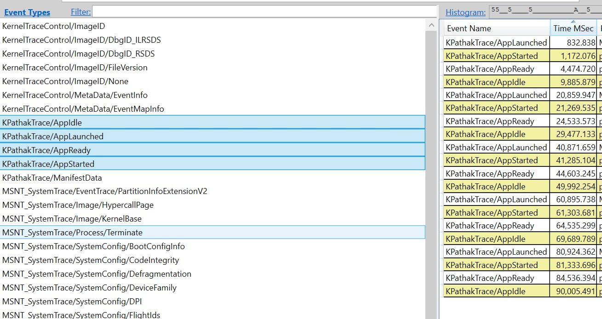

# Introduction

## Usage

```
MeasureStartup.exe <path_to_exe> <args_to_exe> <iterations> <delay_in_secs>
```

A small utility that can measure the startup time of a UI .NET application by sending events of the form `*KpathakTrace`. It launches the given application and launches it `iterations` times. It closes the application after `delay_in_secs` seconds before launching the next time. As soon as it launches the application, it emits the `KpathakTrace/AppLaunched` event. This event can then be correlated to the corresponding `AppStarted` event (details below) that will be emitted by the application itself. `AppStarted - AppLaunched` should give approxiamate duration to start the application, including but not limited to assembly loading and JITting the methods.

# How to use it?

The application that needs to be profiled will also need to add below code of `EventSource` and then the respective methods should be called from corresponding places to log the event.

```c#
using System;
using System.Diagnostics.Tracing;

namespace PaintDotNet.KpathakEvents;

[EventSource(Name = "KPathakTrace")]
public sealed class AppEventSource : EventSource
{
#pragma warning disable CA2211 // Non-constant fields should not be visible
    public static AppEventSource Log = new AppEventSource();
    private static bool firstIdleLogged = false;
#pragma warning restore CA2211 // Non-constant fields should not be visible

    // The numbers passed to WriteEvent and EventAttribute
    // must increment with each logging method.
    [Event(2)]
    public void AppStarted() { WriteEvent(2, ""); }

    [Event(3)]
    public void AppReady() { WriteEvent(3, ""); }

    [Event(4)]
    public void AppIdle()
    {
        if (firstIdleLogged)
        {
            return;
        }
        WriteEvent(4, "");
        firstIdleLogged = true;
    }
}

```

# How to consume it?

You need to have `PerfView` installed. There might be other ways to measure it, but I haven't explored them.

Execute the following command:

```
path\to\perfview -KernelEvents:Process -OnlyProviders:*KPathakTrace collect outputfile.etl
```

This command will have perfview listen to the `KPathakTrace` events only. Next, launch the app multiple times using `MeasureStartup`.

# How to see the events?

In perfview, open the `.etl` file "Events" section and you should see events like below:



